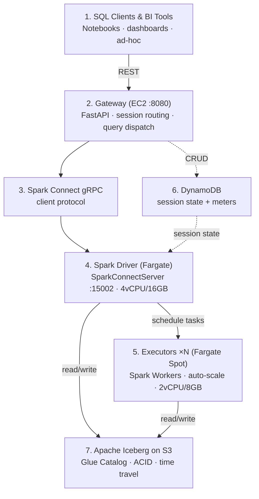

# Code Flow

Read top to bottom: **1 → 2 → 3 → (4 → 5, with 6 as side note) → 7**



## Reading Order

Start here and follow the request path:

| # | File | Why | Lines |
|---|------|-----|-------|
| 1 | `CLAUDE.md` | Project overview, milestones, conventions | 20 |
| 2 | `web/src/api.js` | REST client — see what the UI asks the gateway to do | 67 |
| 3 | `web/src/App.jsx` | Shell: routing, views, how the UI works | 71 |
| 4 | `web/src/views/Worksheet.jsx` | Core feature: SQL editor → run query → show results | 424 |
| 5 | `gateway/main.py` | Heart of the system: all API routes, session lifecycle, query execution | 717 |
| 6 | `gateway/store.py` | DynamoDB helpers (called from main.py) | 88 |
| 7 | `infra/ecs.tf` | How driver + executor tasks are defined on Fargate | 67 |
| 8 | `driver/entrypoint.sh` | What happens when a driver container boots | 47 |
| 9 | `driver/executor-entrypoint.sh` | What happens when an executor container boots | 20 |
| 10 | `infra/gateway.tf` | How the gateway EC2 is provisioned | 34 |
| 11 | `infra/gateway-init.sh` | Gateway boot script: install deps → clone → systemd | 3 |

Then explore the rest at your own pace:

| File | What it is |
|------|------------|
| `web/src/views/Warehouses.jsx` | Warehouse CRUD UI (create/suspend/resume/destroy) |
| `web/src/views/History.jsx` | Query history table with detail panel |
| `web/src/components/QueryDag.jsx` | Snowflake-style query profile DAG viz |
| `web/src/components/Sidebar.jsx` | Collapsible nav sidebar |
| `web/src/components/Topbar.jsx` | Top bar: view title, theme toggle |
| `web/src/views/DataExplorer.jsx` | Mock catalog tree (not wired yet) |
| `infra/vpc.tf` | VPC, subnets, IGW |
| `infra/dynamodb.tf` | Sessions + meters tables |
| `infra/cloudwatch.tf` | Log groups, 1-day retention |
| `infra/ecr.tf` | Container image registry |
| `infra/vpc_endpoints.tf` | Optional VPC endpoints (off by default) |
| `infra/outputs.tf` | Terraform outputs |
| `driver/Dockerfile` | Spark 4.0.2 container build |
| `driver/smoke_test.py` | Verification: `spark.sql("select 1")` over gRPC |

## File Map

```
flashpoint/
├── gateway/           EC2-hosted control plane (FastAPI)
│   ├── main.py        ← all API routes + Spark Connect client + DAG fetcher
│   └── store.py       ← DynamoDB session persistence helpers
│
├── driver/            Spark container image
│   ├── Dockerfile     ← Spark 4.0.2, JDK 17, ARM64
│   ├── entrypoint.sh  ← driver: start master → launch SparkConnectServer
│   └── executor-entrypoint.sh  ← executor: start worker → register with master
│
├── web/               React + Vite UI (Tailwind, Lucide icons)
│   └── src/
│       ├── App.jsx           ← root shell, client-side routing via state
│       ├── api.js            ← fetch() wrapper for gateway REST
│       ├── views/            ← Worksheet, Warehouses, History, DataExplorer
│       └── components/       ← Sidebar, Topbar, QueryDag
│
├── infra/             OpenTofu IaC (VPC, ECS, ECR, DynamoDB, gateway EC2)
│   ├── ecs.tf          ← driver + executor task defs
│   ├── gateway.tf      ← EC2 instance + IAM + user-data
│   ├── dynamodb.tf     ← sessions + meters tables
│   ├── vpc.tf          ← public subnets, IGW
│   └── gateway-init.sh ← boot script: install deps → clone → systemd service
│
├── bench/             [planned] TPC-DS/TPC-H benchmarks
├── metering/          [planned] cost accounting
└── catalog/           [planned] Glue/Iceberg integration
```

## Request Lifecycle

```
1. CREATE WAREHOUSE
   UI POST /sessions  →  gateway ecs.run_task(driver)  →  wait RUNNING
                       →  gateway ecs.run_task(executor×N, SPARK_MASTER_URL)
                       →  store in DynamoDB  →  return session_id + endpoint

2. RUN QUERY
   UI POST /sessions/{id}/query {sql}
     →  gateway: SparkSession.builder.remote("sc://driver-ip:15002").getOrCreate()
     →  spark.sql(sql).collect()  [gRPC to driver SparkConnectServer]
     →  driver schedules work on registered workers
     →  gateway polls :4040 REST API for DAG  →  return columns + rows + profile
```
