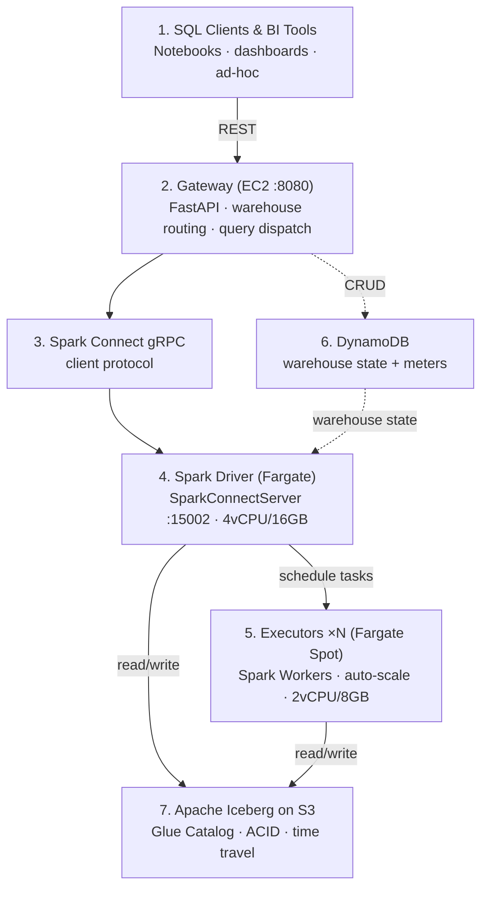

# Code Flow

Read top to bottom: **1 → 2 → 3 → (4 → 5, with 6 as side note) → 7**


```mermaid
flowchart TD
    CLIENTS["1. SQL Clients & BI Tools<br/>Notebooks · dashboards · ad-hoc"]
    GW["2. Gateway (EC2 :8080)<br/>FastAPI · warehouse routing · query dispatch"]
    GRPC["3. Spark Connect gRPC<br/>client protocol"]
    DRIVER["4. Spark Driver (Fargate)<br/>SparkConnectServer :15002 · 4vCPU/16GB"]
    EXEC["5. Executors ×N (Fargate Spot)<br/>Spark Workers · auto-scale · 2vCPU/8GB"]
    DDB["6. DynamoDB<br/>warehouse state + meters"]
    STORAGE["7. Apache Iceberg on S3<br/>Glue Catalog · ACID · time travel"]

    CLIENTS -->|REST| GW
    GW --> GRPC
    GRPC --> DRIVER
    DRIVER -->|schedule tasks| EXEC
    GW -.->|CRUD| DDB
    DDB -.->|warehouse state| DRIVER
    DRIVER -->|read/write| STORAGE
    EXEC -->|read/write| STORAGE
```

## Reading Order

Start here and follow the request path:

| # | File | Why | Lines |
|---|------|-----|-------|
| 1 | `AGENTS.md` | Project overview, milestones, conventions; each component has its own `AGENTS.md` | 92 |
| 2 | `web/src/api.js` | REST client — see what the UI asks the gateway to do | 76 |
| 3 | `web/src/App.jsx` | Shell: routing, views, how the UI works | 107 |
| 4 | `web/src/views/Worksheet.jsx` | Core feature: SQL editor → run query → show results | 591 |
| 5 | `gateway/routes_warehouses.py` | Warehouse lifecycle: create, suspend, resume, resize, delete | 233 |
| 6 | `gateway/routes_queries.py` | Query execution, async runner, cancel, history | 274 |
| 7 | `gateway/store.py` | DynamoDB persistence — the single source of truth | 169 |
| 8 | `infra/ecs.tf` | How driver + executor tasks are defined on Fargate | 198 |
| 9 | `driver/entrypoint.sh` | Driver boot (master → SparkConnectServer) + executor boot (worker) | 54 |
| 10 | `infra/gateway.tf` | How the gateway EC2 is provisioned | 159 |
| 11 | `infra/gateway-init.sh` | Gateway boot script: install deps → clone → systemd | 57 |

Then explore the rest at your own pace:

| File | What it is |
|------|------------|
| `web/src/views/Warehouses.jsx` | Warehouse CRUD UI (create/suspend/resume/destroy) |
| `web/src/views/History.jsx` | Query history table with detail panel |
| `web/src/components/QueryDag.jsx` | Snowflake-style query profile DAG viz |
| `web/src/components/Sidebar.jsx` | Collapsible nav sidebar |
| `web/src/components/Topbar.jsx` | Top bar: view title, theme toggle |
| `web/src/views/DataExplorer.jsx` | Mock catalog tree (not wired yet) |
| `infra/vpc.tf` | VPC, subnets, IGW |
| `infra/dynamodb.tf` | Warehouses + meters tables |
| `infra/cloudwatch.tf` | Log groups, 1-day retention |
| `infra/ecr.tf` | Container image registry |
| `infra/vpc_endpoints.tf` | Optional VPC endpoints (off by default) |
| `infra/outputs.tf` | Terraform outputs |
| `driver/Dockerfile` | Spark 4.0.2 container build |
| `driver/smoke_test.py` | Verification: `spark.sql("select 1")` over gRPC |

## File Map

```
flashpoint/
├── gateway/           EC2-hosted control plane (FastAPI)
│   ├── main.py        ← app wiring + startup reconcile + idle reaper
│   ├── routes_*.py    ← warehouses, queries, costs + history routes
│   ├── store.py       ← DynamoDB persistence — the single source of truth
│   ├── dag.py         ← Spark UI REST → {nodes, edges} query profile
│   └── local_dev.py   ← AWS-mocked local server entry point
│
├── driver/            Spark container image
│   ├── Dockerfile     ← Spark 4.0.2, JDK 17, ARM64
│   ├── entrypoint.sh  ← SPARK_ROLE=driver: master → SparkConnectServer
│   │                     SPARK_ROLE=executor: worker → join master
│   └── smoke_test.py  ← spark.sql('select 1') over gRPC
│
├── web/               React + Vite UI (inline styles + CSS vars, Lucide icons)
│   └── src/
│       ├── App.jsx           ← root shell, view switch, gateway health
│       ├── router.js         ← zero-dep hash routing (#/history/:queryId)
│       ├── api.js            ← fetch() wrapper for gateway REST
│       ├── views/            ← Worksheet, Warehouses, History, QueryProfile, DataExplorer, Costs
│       └── components/       ← Sidebar, Topbar, QueryDag, OfflineBanner
│
├── infra/             OpenTofu IaC (VPC, ECS, ECR, DynamoDB, gateway EC2)
│   ├── ecs.tf          ← driver + executor task defs
│   ├── gateway.tf      ← EC2 instance + IAM + user-data
│   ├── dynamodb.tf     ← warehouses + meters + queries tables
│   ├── vpc.tf          ← public subnets, IGW
│   └── gateway-init.sh ← boot script: install deps → clone → systemd service
│
├── scripts/           e2e_demo.py (local end-to-end), teardown.sh (zero-spend destroy)
└── docs/              ADRs, deep dives, static product pages
```

## Request Lifecycle

```
1. CREATE WAREHOUSE
   UI POST /warehouses  →  gateway ecs.run_task(driver)  →  wait RUNNING
                       →  gateway ecs.run_task(executor×N, SPARK_MASTER_URL)
                       →  store in DynamoDB  →  return warehouse_id + endpoint

2. RUN QUERY
   UI POST /warehouses/{id}/query {sql}
     →  gateway: SparkSession.builder.remote("sc://driver-ip:15002").getOrCreate()
     →  spark.sql(sql).collect()  [gRPC to driver SparkConnectServer]
     →  driver schedules work on registered workers
     →  gateway polls :4040 REST API for DAG  →  return columns + rows + profile
```
